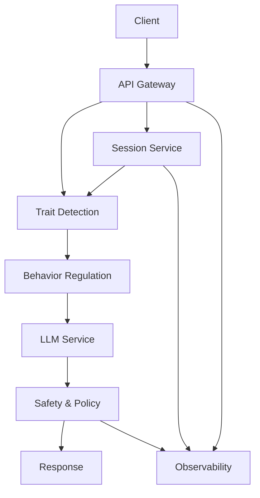

# Adaptive LLM-Based Chatbot with Personality-Aware Dialogue: Technical Framework

## 1. Scope and objectives
- Goal: Build a production-ready chatbot that adapts tone and behavior to user personality (Big Five), aligned with the Zurich Model (security, arousal, affiliation).
- Target domains: Elder support, mental health self-help, education/tutoring, customer support, digital companionship.
- Success metrics: Conversation quality (tone, coherence), needs alignment, user satisfaction/engagement, safety incidents (↓), resolution/escalation effectiveness.

## 2. System architecture (high-level)
- Client surfaces: Web/mobile app, WhatsApp/SMS, voice (optional)
- API gateway: Auth, rate limiting, request validation
- Session service: Session state, rolling context window, policy flags (Redis/KeyDB)
- Trait detection service: Updates OCEAN vector per turn (prompt-based or classifier)
- Behavior regulation engine: Maps traits → prompts; resolves conflicts; constructs final instruction
- LLM service: Provider abstraction (OpenAI/Azure/vLLM); generation params per profile
- Safety & policy layer: Moderation, jailbreak detection, PII redaction, grounding
- Observability: Structured logs, metrics, traces; feature flags; evaluation hooks
- Storage: Encrypted logs, minimal PII; key rotation; DSR support



## 3. Data model and interfaces
### 3.1 Core data
- Session: `sessionId`, `userConsent`, `flags`, `historyRef`, `createdAt`
- Turn: `turnId`, `sessionId`, `userMessage`, `assistantMessage`, `oceanVector`, `appliedPrompts`, `safetyEvents`, `latencyMs`
- OCEAN Vector: `{ O: -1|0|1, C: -1|0|1, E: -1|0|1, A: -1|0|1, N: -1|0|1 }`

### 3.2 Public API (minimal)
- POST `/chat`
  - Request:
```json
{
  "sessionId": "uuid",
  "message": "string",
  "metadata": {"locale": "en", "channel": "web"}
}
```
  - Response:
```json
{
  "assistantMessage": "string",
  "oceanVector": {"O": 0, "C": 1, "E": -1, "A": 0, "N": -1},
  "appliedPrompts": ["Focus on familiar topics; reduce novelty.", "Provide structured guidance.", "Calm, reflective style.", "Neutral stance.", "Offer comfort; acknowledge anxieties."],
  "safety": {"moderation": "pass"},
  "latencyMs": 1240
}
```

## 4. Trait detection service
### 4.1 Prompt-based detection (baseline)
- Use a deterministic, constrained output schema to extract OCEAN per user message with brief history.
- Example instruction (system):
```
You are a detector that infers Big Five (O,C,E,A,N) from the user's last message, considering brief context. Output ONLY JSON with keys O,C,E,A,N in {-1,0,1}; 1=high trait, -1=low trait, 0=insufficient evidence. N is inverted polarity: 1=emotionally stable, -1=emotionally sensitive.
```
- Example schema (tooling-side validation):
```json
{
  "type": "object",
  "properties": {
    "O": {"enum": [-1,0,1]},
    "C": {"enum": [-1,0,1]},
    "E": {"enum": [-1,0,1]},
    "A": {"enum": [-1,0,1]},
    "N": {"enum": [-1,0,1]}
  },
  "required": ["O","C","E","A","N"],
  "additionalProperties": false
}
```
- Cumulative update: Maintain a rolling vector; update dimension i if confident change observed; otherwise keep previous or 0.

### 4.2 Classifier (optional upgrade)
- Fine-tune a small model on dialogue snippets labeled with OCEAN polarities; ensemble with prompt-based output for stability.
- Confidence thresholding: flip to ±1 only above calibrated thresholds; else 0.

## 5. Behavior regulation engine
### 5.1 Mapping table
- O: +1 invite exploration | -1 reduce novelty
- C: +1 structured guidance | -1 flexible, low-structure
- E: +1 energetic, sociable tone | -1 calm, reflective style
- A: +1 warmth, empathy, collaboration | -1 neutral, matter-of-fact
- N: +1 reassure stability/confidence | -1 offer comfort; acknowledge anxieties

### 5.2 Prompt construction
- Retrieve prompts for all non-zero traits; concatenate into a single regulation instruction appended to assistant system prompt per turn.
- Conflict handling: If E=-1 and A=+1, choose calm yet warm tone; resolve via priority rules (Security N > Affiliation A > Arousal O/E).
- Generation controls: Lower temperature for N=-1 (stability), allow higher for O=+1/E=+1 (creativity/social energy) within safe bounds.

## 6. Safety & policy layer
- Moderation: Run user and assistant text through provider moderation; block/redirect unsafe content; add “refuse + offer support” templates.
- Jailbreak/abuse detection: Heuristics + classifier; degrade temperature; restrict capabilities; alert.
- PII redaction: Regex + ML; store tokens hashed/salted if logging is required.
- Grounding: Optional retrieval to verified resources for advice-heavy domains.
- Rate limiting and abuse throttling per session and IP.

## 7. Observability and evaluation
- Structured logging: requestId, sessionId, oceanVector, prompts, moderation outcome, latency, tokens.
- Metrics: success rates, refusal rates, safety incidents, average scores from evaluation harness.
- Evaluation harness: batch run simulated dialogues; score with evaluator on criteria: Tone, Coherence, Personality Needs; for regulated also Detection and Regulation.
- Dashboards: per release channel; regression alerts.

## 8. Configuration and MLOps
- Provider abstraction: OpenAI/Azure/vLLM behind a single interface; configurable models and params per environment.
- Feature flags: enable/disable regulation; swap detection strategy; adjust priorities.
- A/B testing: compare regulated vs baseline; different mapping tables; analyze metrics.
- Secrets management: Vault/KMS; rotate keys; least privilege.
- Data governance: consent tracking, retention windows, deletion (DSR), encryption at rest/in transit.

## 9. Implementation outline (reference stack)
- Runtime: Python (FastAPI) or Node (NestJS). Trait detection/regulation modules as services.
- Cache/session: Redis. Storage: Postgres (structured turns) or object store for transcripts.
- LLM: OpenAI GPT-4.x/mini for prod; vLLM + Llama 3.x for local/dev with safety wrappers.
- CI/CD: GitHub Actions; security scanning; unit/integration tests; canary deploy.

## 10. Example assistant system prompt (skeleton)
```
You are an adaptive, supportive assistant. Goals: be helpful, safe, and align with the user's personality.
When responding, apply the following behavior regulation instructions if present:
{{REGULATION_PROMPTS}}
Keep advice scoped to your role; escalate when risk is detected. Be concise and empathetic.
```

## 11. Minimal turn handler (pseudocode)
```python
# receive(user_message, session_id)
session = session_store.get(session_id)
context = session.build_context(last_k=6)
# 1) detect traits
traits = detect_ocean(user_message, context)
# 2) update cumulative vector
updated = update_vector(session.ocean, traits)
# 3) build regulation instruction
prompts = prompts_for(updated)
# 4) generate response with safety
draft = llm.generate(system=BASE_PROMPT + prompts, context=context, user=user_message)
safe = safety.filter(draft, user_message)
# 5) persist + return
log_turn(session_id, user_message, safe, updated, prompts)
return safe, updated, prompts
```

## 12. Testing plan
- Unit tests: mapping table, conflict resolver, vector update logic, JSON schema validation.
- Integration tests: end-to-end conversation with seeded personalities; safety refusals.
- Offline eval: reproduce simulated experiments; track regression on criteria.

## 13. Rollout checklist
- Privacy policy + consent flows finalized
- Safety policies validated; escalation playbooks defined
- Logs/metrics dashboards live; on-call ownership
- Canary launch with A/B; monitor key metrics
- Documentation for support/escalation

## 14. Future enhancements
- Finer-grained, probabilistic trait scoring
- Multimodal cues (voice prosody, wearables) for detection/regulation
- Auto-optimization of prompts via bandits/PEFT
- Personalized long-term memory with consent and controls